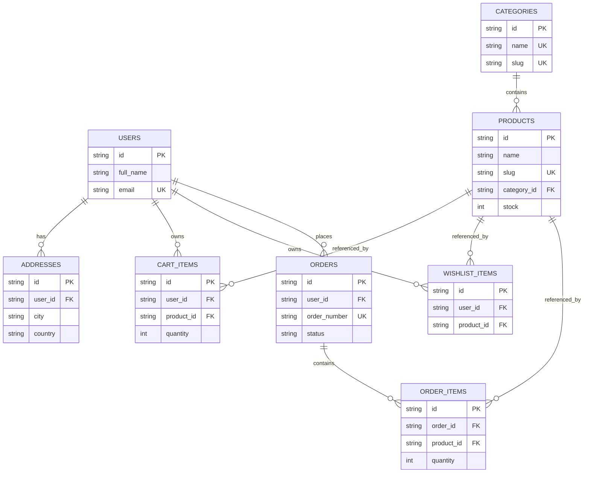
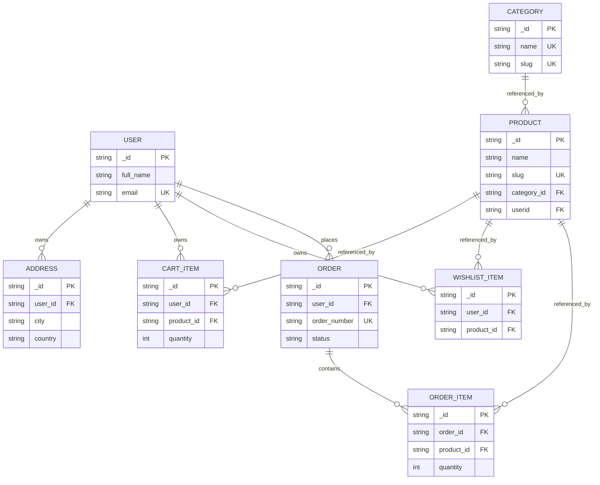

## Backend Folder Structure

```text
server/
	src/
		config/
			db.ts
		controllers/
		middleware/
		models/
		routes/
		services/
		types/
		utils/
		index.ts
```

### Purpose

- `config/` - environment and database setup.
- `controllers/` - request handlers.
- `middleware/` - auth, error handling, request validation
- `models/` - Mongoose schemas and models
- `routes/` - route definitions
- `services/` - business logic and database operations
- `types/` - shared TypeScript types and interfaces
- `utils/` - helpers and reusable functions

### Suggested Entry Files

- `src/index.ts` - starts the server
- `src/config/db.ts` - connects to MongoDB
- `src/routes/index.ts` - combines all route modules


```sql
	use ecommerce;
	SET FOREIGN_KEY_CHECKS = 0;
	TRUNCATE TABLE order_items;
	TRUNCATE TABLE orders;
	TRUNCATE TABLE cart_items;
	TRUNCATE TABLE wishlist_items;
	TRUNCATE TABLE addresses;
	TRUNCATE TABLE users;
	TRUNCATE TABLE products;
	TRUNCATE TABLE categories;
	SET FOREIGN_KEY_CHECKS = 1;


```


connect ECONNREFUSED 127.0.0.1:27017, connect ECONNREFUSED ::1:27017

Windows:Press Win + R, type services.msc, and hit Enter.
Find MongoDB Server (or MongoDB) in the list.
If the status isn't "Running," right-click it and select Start

## API Routes

The server mounts these routers from `src/index.ts`:

| Base path | File | Notes |
| --- | --- | --- |
| `/api/users` | `src/routes/user.routes.ts` | user create, login, profile |
| `/api/categories` | `src/routes/catagorie.routes.ts` | category list |
| `/api/products` | `src/routes/product.routes.ts` | product CRUD |
| `/api/wishlist` | `src/routes/wishlist.routes.ts` | wishlist actions |
| `/api/cart` | `src/routes/cart.routes.ts` | cart actions |
| `/api/addresses` | `src/routes/address.routes.ts` | address CRUD |
| `/api/orders` | `src/routes/order.routes.ts` | order lifecycle |

### Route Details

#### Users

- `POST /api/users/create` - create a new user
- `POST /api/users/login` - sign in a user
- `GET /api/users/profile` - get the authenticated user profile

#### Categories

- `GET /api/categories/` - list categories

#### Products

- `GET /api/products/user` - get the authenticated user's products
- `POST /api/products/create` - create a product
- `GET /api/products/:id` - get a product by id
- `DELETE /api/products/delete/:id` - delete a product
- `PUT /api/products/update/:id` - update a product

#### Wishlist

- `POST /api/wishlist/add` - add an item to wishlist
- `GET /api/wishlist/` - get wishlist items
- `DELETE /api/wishlist/remove/:id` - remove an item from wishlist

#### Cart

- `GET /api/cart/` - get the authenticated cart
- `POST /api/cart/add` - add an item to cart

#### Addresses

- `POST /api/addresses/add` - add an address
- `GET /api/addresses/list` - list saved addresses
- `PUT /api/addresses/update/:id` - update an address
- `DELETE /api/addresses/delete/:id` - delete an address

#### Orders

- `POST /api/orders/create` - create an order
- `GET /api/orders/my` - list the authenticated user's orders
- `GET /api/orders/:id` - get an order by id
- `PUT /api/orders/update/:id` - update an order
- `POST /api/orders/cancel/:id` - cancel an order

## Database Diagrams

### SQL ER Diagram



### MongoDB Logical Diagram



MongoDB uses ObjectId references between collections, while `shipping_address` is stored as an embedded object inside `orders`.

## Controller Query Reference

Each controller is summarized below in a report-style table so the SQL path and MongoDB path can be compared side by side.

### `user.controller.ts`

| Action | SQL | MongoDB | Purpose |
| --- | --- | --- | --- |
| Check existing user | `SELECT * FROM users WHERE email = ?` | `findOne({ email })` | Prevent duplicate signup email. |
| Check existing phone | `SELECT * FROM users WHERE email = ?` followed by phone comparison | `findOne({ phone })` | Prevent duplicate signup phone. |
| Create user | `INSERT INTO users (full_name, email, phone, password_hash) VALUES (?, ?, ?, ?)` | `create({ full_name, email, phone, password_hash })` | Store the new user. |
| Load user after insert | `SELECT * FROM users WHERE email = ?` | `findOne({ email })` | Confirm the inserted user record. |
| Login lookup | `SELECT * FROM users WHERE email = ?` | `findOne({ email })` | Fetch account before password check. |
| Save token | `UPDATE users SET refresh_token = ? WHERE id = ?` | `save()` after setting `refresh_token` | Store the issued JWT. |
| Profile fetch | `select id, full_name, email, phone from users where id = ?` | `findById(userId)` | Return the authenticated profile. |

### `category.controller.ts`

| Action | SQL | MongoDB | Purpose |
| --- | --- | --- | --- |
| List categories | `SELECT * FROM categories` | `categorySchema.find().lean()` | Return all categories. |

### `product.controller.ts`

| Action | SQL | MongoDB | Purpose |
| --- | --- | --- | --- |
| Check slug | `SELECT slug FROM products WHERE slug = ?` | `findOne({ slug })` | Keep product slugs unique. |
| Create product | `INSERT INTO products (name, description, price, category_id, slug,userid, stock, image_url) VALUES (?, ?, ?, ?, ?, ?, ?, ?)` | `create(...)` | Save a new product. |
| Get by id | `SELECT * FROM products WHERE id = ?` | `findById(id)` | Load a single product. |
| Get by slug | `SELECT * FROM products WHERE slug = ? LIMIT 1` | `findOne({ slug }).lean()` | Load a single product by slug. |
| Update product | `UPDATE products SET name = ?, description = ?, price = ?, category_id = ?, stock = ?, image_url = ? WHERE id = ?` | `save()` after field updates | Persist product changes. |
| Delete product | `DELETE FROM products WHERE id = ?` | `findByIdAndDelete(id)` | Remove a product. |
| Get user products | `SELECT * FROM products WHERE userid = ?` | `find({ userid: userId })` | List products owned by the user. |
| Resolve category filter | `SELECT id FROM categories WHERE id = ? OR slug = ? LIMIT 1` | `categorySchema.findOne({ slug: categoryValue }).lean()` | Convert category slug to id. |
| Search products | `SELECT * FROM products ... LIMIT ... OFFSET ...` | `find(filter).sort(sortObj).skip(offset).limit(limitNum).lean()` | Return the paged search result. |
| Count search results | `SELECT COUNT(*) as total FROM products ...` | `countDocuments(filter)` | Return the total number of matches. |

### `cart.controller.ts`

| Action | SQL | MongoDB | Purpose |
| --- | --- | --- | --- |
| Check stock | `SELECT stock FROM products WHERE id = ?` | `findOne({ user_id: userId, product_id: productId })` for item lookup | Ensure the cart quantity is valid. |
| Check existing item | `SELECT quantity FROM cart_items WHERE user_id = ? AND product_id = ?` | `findOne({ user_id: userId, product_id: productId })` | Detect whether the item is already in the cart. |
| Add new cart row | `INSERT INTO cart_items (user_id, product_id, quantity) VALUES (?, ?, ?)` | `save()` | Create a cart item. |
| Update existing cart row | `UPDATE cart_items SET quantity = quantity + ? WHERE user_id = ? AND product_id = ?` | `existing.quantity += quantity; save()` | Increase quantity. |
| Remove cart row | `DELETE FROM cart_items WHERE user_id = ? AND product_id = ?` | `findOneAndDelete({ _id: id, user_id: userId })` | Remove the item from the cart. |
| List cart items | `SELECT ... FROM cart_items c JOIN products p ON c.product_id = p.id WHERE c.user_id = ?` | `find({ user_id: userId }).populate('product_id')` | Return cart contents with product info. |
| Update cart quantity | `UPDATE cart_items SET quantity = ? WHERE id = ? AND user_id = ?` | `findOneAndUpdate({ _id: id, user_id: userId }, { quantity }, { new: true })` | Set a specific quantity. |

### `wishlist.controller.ts`

| Action | SQL | MongoDB | Purpose |
| --- | --- | --- | --- |
| List wishlist | `SELECT w.id, w.created_at, p.* FROM wishlist_items w JOIN products p ON w.product_id = p.id WHERE w.user_id = ?` | `find({ user_id: userId }).populate('product_id')` | Return wishlist items with product data. |
| Prevent duplicate | `SELECT * FROM wishlist_items WHERE user_id = ? AND product_id = ?` | `findOne({ user_id: userId, product_id: productId })` | Stop duplicate wishlist rows. |
| Add wishlist item | `INSERT INTO wishlist_items (user_id, product_id) VALUES (?, ?)` | `save()` | Save a new wishlist item. |
| Remove wishlist item | `DELETE FROM wishlist_items WHERE id = ? AND user_id = ? AND product_id = ?` | `findOneAndDelete({ _id: id, user_id: userId })` | Remove the item from the wishlist. |

### `address.controller.ts`

| Action | SQL | MongoDB | Purpose |
| --- | --- | --- | --- |
| Add address | `INSERT INTO addresses (user_id, full_name, phone, address_line1, address_line2, city, state, postal_code, country, is_default) VALUES (?, ?, ?, ?, ?, ?, ?, ?, ?, ?)` | `new addressSchema(...).save()` | Save a shipping address. |
| List addresses | `SELECT * FROM addresses WHERE user_id = ? ORDER BY is_default DESC, created_at DESC` | `find({ user_id: userId }).sort({ is_default: -1, createdAt: -1 })` | Return saved addresses. |
| Check address ownership | `SELECT * FROM addresses WHERE id = ? AND user_id = ?` | `findOne({ _id: id, user_id: userId })` | Ensure the user owns the address. |
| Update address | `UPDATE addresses SET full_name = ?, phone = ?, address_line1 = ?, address_line2 = ?, city = ?, state = ?, postal_code = ?, country = ?, is_default = ? WHERE id = ? AND user_id = ?` | `findOneAndUpdate({ _id: id, user_id: userId }, updateData, { new: true })` | Save address changes. |
| Delete address | `DELETE FROM addresses WHERE id = ? AND user_id = ?` | `findOneAndDelete({ _id: id, user_id: userId })` | Remove the address. |

### `order.controller.ts`

| Action | SQL | MongoDB | Purpose |
| --- | --- | --- | --- |
| Validate items | `SELECT id, name, image_url, price, stock FROM products WHERE id = ?` | `findById(it.product_id).lean()` | Confirm products exist and have stock. |
| Create order | `INSERT INTO orders (user_id, order_number, status, total_amount, shipping_address, payment_method, payment_status) VALUES (?, ?, ?, ?, ?, ?, ?)` | `new Order(...).save()` | Save the order header. |
| Resolve new order id | `SELECT id FROM orders WHERE order_number = ? AND user_id = ? LIMIT 1` | `order._id` | Get the created order id. |
| Create order items | `INSERT INTO order_items (order_id, product_id, product_name, product_image, price, quantity) VALUES (?, ?, ?, ?, ?, ?)` | `new OrderItem(...).save()` | Save line items. |
| Reduce stock | `BEFORE INSERT` trigger on `order_items` decrements `products.stock` | `findOneAndUpdate({ _id: it.product_id, stock: { $gte: it.quantity } }, { $inc: { stock: -it.quantity } })` | Reduce product stock after the order is placed. |
| Clear cart | `DELETE FROM cart_items WHERE user_id = ?` | `cartitemSchema.deleteMany({ user_id: userId })` | Empty the cart after checkout. |
| List orders | `SELECT * FROM orders WHERE user_id = ? ORDER BY created_at DESC` | `Order.find({ user_id: userId }).sort({ createdAt: -1 }).lean()` | Return user orders newest first. |
| Load order items | `SELECT * FROM order_items WHERE order_id = ?` | `OrderItem.find({ order_id: ... }).lean()` | Attach items to each order. |
| Load single order | `SELECT * FROM orders WHERE id = ? AND user_id = ?` | `Order.findOne({ _id: id, user_id: userId }).lean()` | Return one order safely. |
| Update order | `UPDATE orders SET status = ?, payment_status = ? WHERE id = ? AND user_id = ?` | `findOneAndUpdate(...)` | Change order status or payment state. |
| Cancel order | `UPDATE orders SET status = ? WHERE id = ? AND user_id = ?` | `findOneAndUpdate(..., { status: 'cancelled' }, { new: true })` | Mark an order as cancelled. |

### Notes

The current SQL controller for products writes a `userid` column, while the attached SQL schema file does not define that field yet. The MongoDB product model does define `userid`, so the MongoDB diagram reflects the code as written.

## Runtime Notes

- The server chooses the database implementation from `DATA_BASE_TYPE`.
- Set `DATA_BASE_TYPE=sql` to use the SQL connection path.
- Set `DATA_BASE_TYPE=mongodb` to use the MongoDB connection path.
- The MongoDB connection error shown above usually means MongoDB is not running locally on port `27017`.

## SQL Trigger: automatic stock reduction on order

The project now includes a SQL trigger that automatically reduces the `products.stock` when new rows are inserted into `order_items`. Paste or apply the following snippet to your MySQL/MariaDB database (or run the `Schema.sql` file) so the trigger is created.

```sql
DROP TRIGGER IF EXISTS before_order_items_insert_reduce_stock;
DELIMITER //
CREATE TRIGGER before_order_items_insert_reduce_stock
BEFORE INSERT ON order_items
FOR EACH ROW
BEGIN
	DECLARE available_stock INT;

	SELECT stock INTO available_stock
	FROM products
	WHERE id = NEW.product_id
	FOR UPDATE;

	IF available_stock IS NULL THEN
		SIGNAL SQLSTATE '45000'
			SET MESSAGE_TEXT = 'Product not found';
	END IF;

	IF available_stock < NEW.quantity THEN
		SIGNAL SQLSTATE '45000'
			SET MESSAGE_TEXT = 'Insufficient stock';
	END IF;

	UPDATE products
	SET stock = stock - NEW.quantity
	WHERE id = NEW.product_id;
END//
DELIMITER ;
```

Line-by-line explanation

1. DROP TRIGGER IF EXISTS before_order_items_insert_reduce_stock; — Remove any existing trigger with the same name so the script can be re-run safely.
2. DELIMITER // — Change the statement delimiter so the trigger body can contain semicolons without ending the CREATE TRIGGER statement.
3. CREATE TRIGGER before_order_items_insert_reduce_stock — Start creating a trigger named `before_order_items_insert_reduce_stock`.
4. BEFORE INSERT ON order_items — The trigger runs before a new row is inserted into the `order_items` table.
5. FOR EACH ROW — Execute the trigger body for each row being inserted.
6. BEGIN — Begin the trigger body block.
7. DECLARE available_stock INT; — Declare a local variable to hold the current stock value for the target product.
8. SELECT stock INTO available_stock — Read the current `stock` value into the variable.
9. FROM products — Select from the `products` table.
10. WHERE id = NEW.product_id — Match the product row whose id equals the `product_id` in the row being inserted (`NEW.product_id`).
11. FOR UPDATE; — Lock the selected product row for update to prevent race conditions (within transactions).
12. IF available_stock IS NULL THEN — If no product row was found, `available_stock` will be NULL.
13. SIGNAL SQLSTATE '45000' — Raise a generic user-defined SQL error to abort the insert.
14. SET MESSAGE_TEXT = 'Product not found'; — Provide an explanatory error message for the raised error.
15. END IF; — Close the IF for missing product.
16. IF available_stock < NEW.quantity THEN — If the current stock is less than the quantity being ordered, we cannot fulfill it.
17. SIGNAL SQLSTATE '45000' — Raise an error to abort the insert when stock is insufficient.
18. SET MESSAGE_TEXT = 'Insufficient stock'; — Error message explaining why the insert failed.
19. END IF; — Close the IF for insufficient stock.
20. UPDATE products — Begin updating the products table.
21. SET stock = stock - NEW.quantity — Subtract the ordered quantity from the product's stock.
22. WHERE id = NEW.product_id; — Apply the update to the matched product row.
23. END// — End the trigger body (matching the custom delimiter `//`).
24. DELIMITER ; — Restore the default SQL statement delimiter.

Notes and operational guidance

- The trigger uses row-level locking (`FOR UPDATE`) to reduce race conditions when multiple orders are created concurrently. It assumes inserts into `order_items` occur inside a transaction that also inserts the `orders` row (the SQL controller uses transactions for order creation).
- If the trigger raises the `Product not found` or `Insufficient stock` error, the surrounding transaction should be rolled back and the order creation will fail. Ensure your application logic handles these errors and returns appropriate responses to clients.
- For MongoDB we implement the same behavior in application code (see `src/controller/order.controller.ts`) because MongoDB does not support equivalent triggers in the same way.

If you'd like, I can also add an explicit migration or a small script to create the trigger in your database automatically.