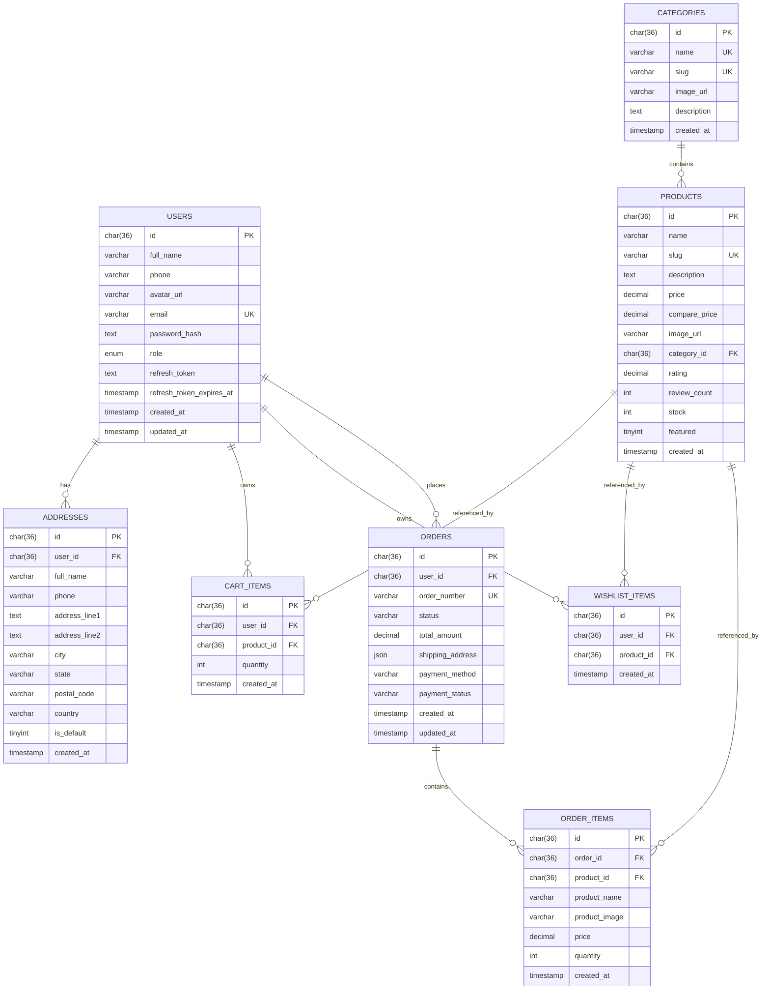
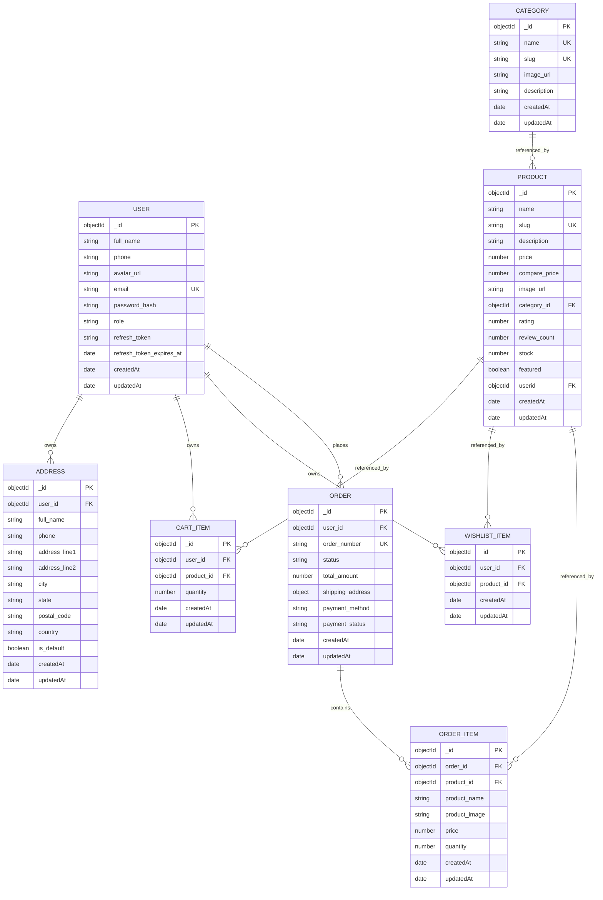

## Backend Folder Structure

```text
server/
	src/
		config/
			db.ts
		controllers/
		middleware/
		models/
		routes/
		services/
		types/
		utils/
		index.ts
```

### Purpose

- `config/` - environment and database setup.
- `controllers/` - request handlers.
- `middleware/` - auth, error handling, request validation
- `models/` - Mongoose schemas and models
- `routes/` - route definitions
- `services/` - business logic and database operations
- `types/` - shared TypeScript types and interfaces
- `utils/` - helpers and reusable functions

### Suggested Entry Files

- `src/index.ts` - starts the server
- `src/config/db.ts` - connects to MongoDB
- `src/routes/index.ts` - combines all route modules


```sql
	use ecommerce;
	SET FOREIGN_KEY_CHECKS = 0;
	TRUNCATE TABLE order_items;
	TRUNCATE TABLE orders;
	TRUNCATE TABLE cart_items;
	TRUNCATE TABLE wishlist_items;
	TRUNCATE TABLE addresses;
	TRUNCATE TABLE users;
	TRUNCATE TABLE products;
	TRUNCATE TABLE categories;
	SET FOREIGN_KEY_CHECKS = 1;


```


connect ECONNREFUSED 127.0.0.1:27017, connect ECONNREFUSED ::1:27017

Windows:Press Win + R, type services.msc, and hit Enter.
Find MongoDB Server (or MongoDB) in the list.
If the status isn't "Running," right-click it and select Start

## API Routes

The server mounts these routers from `src/index.ts`:

| Base path | File | Notes |
| --- | --- | --- |
| `/api/users` | `src/routes/user.routes.ts` | user create, login, profile |
| `/api/categories` | `src/routes/catagorie.routes.ts` | category list |
| `/api/products` | `src/routes/product.routes.ts` | product CRUD |
| `/api/wishlist` | `src/routes/wishlist.routes.ts` | wishlist actions |
| `/api/cart` | `src/routes/cart.routes.ts` | cart actions |
| `/api/addresses` | `src/routes/address.routes.ts` | address CRUD |
| `/api/orders` | `src/routes/order.routes.ts` | order lifecycle |

### Route Details

#### Users

- `POST /api/users/create` - create a new user
- `POST /api/users/login` - sign in a user
- `GET /api/users/profile` - get the authenticated user profile

#### Categories

- `GET /api/categories/` - list categories

#### Products

- `GET /api/products/user` - get the authenticated user's products
- `POST /api/products/create` - create a product
- `GET /api/products/:id` - get a product by id
- `DELETE /api/products/delete/:id` - delete a product
- `PUT /api/products/update/:id` - update a product

#### Wishlist

- `POST /api/wishlist/add` - add an item to wishlist
- `GET /api/wishlist/` - get wishlist items
- `DELETE /api/wishlist/remove/:id` - remove an item from wishlist

#### Cart

- `GET /api/cart/` - get the authenticated cart
- `POST /api/cart/add` - add an item to cart

#### Addresses

- `POST /api/addresses/add` - add an address
- `GET /api/addresses/list` - list saved addresses
- `PUT /api/addresses/update/:id` - update an address
- `DELETE /api/addresses/delete/:id` - delete an address

#### Orders

- `POST /api/orders/create` - create an order
- `GET /api/orders/my` - list the authenticated user's orders
- `GET /api/orders/:id` - get an order by id
- `PUT /api/orders/update/:id` - update an order
- `POST /api/orders/cancel/:id` - cancel an order

## Database Diagrams

### SQL ER Diagram



### MongoDB Logical Diagram



MongoDB uses ObjectId references between collections, while `shipping_address` is stored as an embedded object inside `orders`.

## Controller Query Reference

### `user.controller.ts`

`SELECT * FROM users WHERE email = ?` checks whether a signup email already exists. `INSERT INTO users (full_name, email, phone, password_hash) VALUES (?, ?, ?, ?)` creates the new SQL user, and the follow-up `SELECT * FROM users WHERE email = ?` reads the inserted row back. On login, `SELECT * FROM users WHERE email = ?` loads the account for password verification, then `UPDATE users SET refresh_token = ? WHERE id = ?` stores the generated JWT. In MongoDB, the same flow is handled with `findOne({ email })`, `findOne({ phone })`, `create(...)`, `findOne({ email })` on login, and `save()` after assigning `refresh_token`. `select id, full_name, email, phone from users where id = ?` returns the authenticated user profile in SQL, while `findById(userId)` does the same in MongoDB.

### `category.controller.ts`

`SELECT * FROM categories` returns every category from SQL. The MongoDB branch uses `categorySchema.find().lean()` to return the same list from the `categories` collection.

### `product.controller.ts`

`SELECT slug FROM products WHERE slug = ?` checks slug uniqueness before a SQL insert. `INSERT INTO products (name, description, price, category_id, slug,userid, stock, image_url) VALUES (?, ?, ?, ?, ?, ?, ?, ?)` creates a product, and `SELECT * FROM products WHERE id = ?` or `SELECT * FROM products WHERE slug = ? LIMIT 1` fetch a single product by id or slug. `UPDATE products SET name = ?, description = ?, price = ?, category_id = ?, stock = ?, image_url = ? WHERE id = ?` updates a product, while `DELETE FROM products WHERE id = ?` removes it. `SELECT * FROM products WHERE userid = ?` returns all products for the authenticated user. For search, `SELECT id FROM categories WHERE id = ? OR slug = ? LIMIT 1` resolves the category filter, `SELECT * FROM products ... LIMIT ... OFFSET ...` returns the paged product list, and `SELECT COUNT(*) as total FROM products ...` returns the matching row count. In MongoDB, the same actions use `findOne({ slug })`, `create(...)`, `findById(id)`, `findByIdAndDelete(id)`, `find({ userid: userId })`, `findOne({ slug }).lean()`, `categorySchema.findOne({ slug: categoryValue }).lean()`, `find(filter).sort(sortObj).skip(offset).limit(limitNum).lean()`, and `countDocuments(filter)`.

### `cart.controller.ts`

`SELECT stock FROM products WHERE id = ?` validates stock before cart changes. `SELECT quantity FROM cart_items WHERE user_id = ? AND product_id = ?` checks whether the item already exists, `DELETE FROM cart_items WHERE user_id = ? AND product_id = ?` removes the row when quantity drops to zero, `UPDATE cart_items SET quantity = quantity + ? WHERE user_id = ? AND product_id = ?` increments an existing row, and `INSERT INTO cart_items (user_id, product_id, quantity) VALUES (?, ?, ?)` creates a new cart item. `SELECT ... FROM cart_items c JOIN products p ON c.product_id = p.id WHERE c.user_id = ?` builds the cart response with product details. `DELETE FROM cart_items WHERE id = ? AND user_id = ?` removes a specific cart row, and `UPDATE cart_items SET quantity = ? WHERE id = ? AND user_id = ?` sets a new quantity. In MongoDB, the equivalent operations are `findOne({ user_id: userId, product_id: productId })`, `save()`, `find({ user_id: userId }).populate('product_id')`, `findOneAndDelete({ _id: id, user_id: userId })`, and `findOneAndUpdate({ _id: id, user_id: userId }, { quantity }, { new: true })`.

### `wishlist.controller.ts`

`SELECT w.id, w.created_at, p.* FROM wishlist_items w JOIN products p ON w.product_id = p.id WHERE w.user_id = ?` returns the wishlist with product data. `SELECT * FROM wishlist_items WHERE user_id = ? AND product_id = ?` prevents duplicates before insert, `INSERT INTO wishlist_items (user_id, product_id) VALUES (?, ?)` adds the row, and `DELETE FROM wishlist_items WHERE id = ? AND user_id = ? AND product_id = ?` removes it. In MongoDB, the same flow uses `find({ user_id: userId }).populate('product_id')`, `findOne({ user_id: userId, product_id: productId })`, `save()`, and `findOneAndDelete({ _id: id, user_id: userId })`.

### `address.controller.ts`

`INSERT INTO addresses (user_id, full_name, phone, address_line1, address_line2, city, state, postal_code, country, is_default) VALUES (?, ?, ?, ?, ?, ?, ?, ?, ?, ?)` creates an address, `SELECT * FROM addresses WHERE user_id = ? ORDER BY is_default DESC, created_at DESC` lists saved addresses, `SELECT * FROM addresses WHERE id = ? AND user_id = ?` verifies ownership before editing, `UPDATE addresses SET full_name = ?, phone = ?, address_line1 = ?, address_line2 = ?, city = ?, state = ?, postal_code = ?, country = ?, is_default = ? WHERE id = ? AND user_id = ?` updates the address, and `DELETE FROM addresses WHERE id = ? AND user_id = ?` deletes it. The MongoDB branch uses `new addressSchema(...)` with `save()`, `find({ user_id: userId }).sort({ is_default: -1, createdAt: -1 })`, `findOneAndUpdate({ _id: id, user_id: userId }, updateData, { new: true })`, and `findOneAndDelete({ _id: id, user_id: userId })`.

### `order.controller.ts`

`SELECT id, name, image_url, price, stock FROM products WHERE id = ?` validates each item before order creation. `INSERT INTO orders (user_id, order_number, status, total_amount, shipping_address, payment_method, payment_status) VALUES (?, ?, ?, ?, ?, ?, ?)` creates the order header, `SELECT id FROM orders WHERE order_number = ? AND user_id = ? LIMIT 1` resolves the new order id, and `INSERT INTO order_items (order_id, product_id, product_name, product_image, price, quantity) VALUES (?, ?, ?, ?, ?, ?)` stores the line items. `DELETE FROM cart_items WHERE user_id = ?` clears the cart after checkout. `SELECT * FROM orders WHERE user_id = ? ORDER BY created_at DESC` lists all orders for the user, `SELECT * FROM order_items WHERE order_id = ?` attaches each order's items, `SELECT * FROM orders WHERE id = ? AND user_id = ?` loads a single order, and `UPDATE orders SET status = ?, payment_status = ? WHERE id = ? AND user_id = ?` updates order state. `UPDATE orders SET status = ? WHERE id = ? AND user_id = ?` is used to cancel an order. In MongoDB, these operations are handled with `findById(...)`, `new Order(...)`, `save()`, `new OrderItem(...)`, `cartitemSchema.deleteMany({ user_id: userId })`, `Order.find({ user_id: userId }).sort({ createdAt: -1 }).lean()`, `OrderItem.find({ order_id: ... }).lean()`, `Order.findOne({ _id: id, user_id: userId }).lean()`, `findOneAndUpdate(...)`, and `findOneAndUpdate(..., { status: 'cancelled' }, { new: true })`.

### Notes

The current SQL controller for products writes a `userid` column, while the attached SQL schema file does not define that field yet. The MongoDB product model does define `userid`, so the MongoDB diagram reflects the code as written.

## Runtime Notes

- The server chooses the database implementation from `DATA_BASE_TYPE`.
- Set `DATA_BASE_TYPE=sql` to use the SQL connection path.
- Set `DATA_BASE_TYPE=mongodb` to use the MongoDB connection path.
- The MongoDB connection error shown above usually means MongoDB is not running locally on port `27017`.